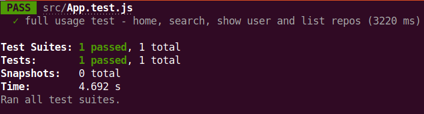

# 🎓 LS Frontend Challenge

This project was bootstrapped with [Create React App](https://github.com/facebook/create-react-app) using the following command:

```
npx create-react-app ls-frontend-challenge
```

<hr>

## 🖵 Live Preview

A live preview is available at [https://frontend-challenge.ddns.net/](https://frontend-challenge.ddns.net/)


<video controls style="width:640px; height: auto;">
  <source src="./src/assets/recorded_live_demo.mp4" type="video/mp4" />
  Your browser does not support the video tag.
</video>

App built with:
```
npm run build
```

and deployed with [PM2](https://pm2.keymetrics.io/)
```
pm2 serve build/ 3000 --name "ls-frontend-challenge" --spa
```

Served via [lighttpd](https://www.lighttpd.net/) on external port :80 with proxy to internal port :3000 \
Secured with SSL certificate issued by [Let's Encrypt](https://letsencrypt.org/) using [certbot](https://certbot.eff.org/)

<hr>

## ⚠️ Requirements

Recommended nodejs version:

```
$ node -v
v18.13.0
```

Lowest nodejs version in which the project was tested:

```
$ node -v
v14.21.2
```

<hr>

## Some additional modules that worth mentioning

- react-router-dom
- sass
<hr>

## 🔧 How to run

Please ensure you have nodejs installed in your system. 18.x 
[Check official website](https://nodejs.org/en/) for more info.

Follow the following instructions to checkout and run the app in development mode.
```
$ git clone https://github.com/ahlidap/ls-frontend-challenge.git ls-frontend-challenge
$ cd ls-frontend-challenge
$ npm install
$ npm start
```

Open [http://localhost:3000](http://localhost:3000) to view it in your browser.

<hr>

## 🧪 Testing

You can run the tests with the following command:
```
npm test
```

Please note, tests will made API requests.\
Internet connectinon is mandatory, or tests will fail.\
Keep in mind, tests are also subject to the API rate limit.



<hr>

## 📜 Quick Notes

- Used react-router-dom to manage routing
- - 404 Page available to unknown routes. eg. [http://localhost:3000/thisdoesnotexists](http://localhost:3000/thisdoesnotexists)
- Pressing "Enter" key on the text input element, will trigger the search
- Button driven pagination on the user search page (Home)
- Infinite Scroll pagination on the Repo Listing under the user page
